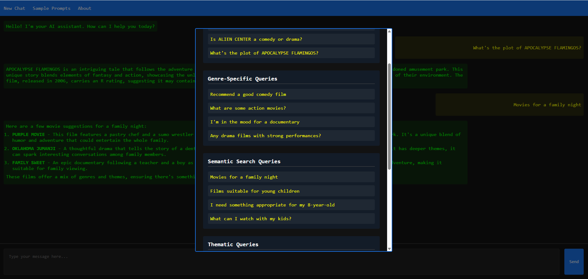

# FilmRAG: A LAMP-Based RAG Implementation Using MySQL Vector Capabilities

## Introduction

MySQL Enterprise Edition integrates seamlessly with the LAMP (Linux, Apache, MySQL, PHP) stack, enhancing open-source capabilities with enterprise features. MySQL EE works with the LAMP stack by:

After installing the LAMP Stack , you will Deploy and test the "Sakila Film Library with Time Converter" web application. This application displays the Sakila.Film data while providing a time conversion tool. Users can enter seconds and convert them to either HH:MM:SS format or written time descriptions using MySQL Enterprise Edition's JavaScript function. This LAMP-based application demonstrates practical use of database features within MySQL Enterprise Edition.

**Note:** The application code in this lab is intended for educational purposes only. It is designed to help developers learn and practice application development skills with MySQL Enterprise Edition. The code is not designed to be used in a production environment

_Estimated Lab Time:_ 15 minutes

### Objectives

In this lab, you will be guided through the following tasks:

- Install Apache and PHP
- Learn to create PHP / MYSQL Connect Application
- Deploy the Sample LAMP WEB Application

### Prerequisites

- An Oracle Trial or Paid Cloud Account
- Some Experience with MySQL SQL and  PHP
- Completed Lab 5


## Application Overview

This is a film information chatbot built entirely on the LAMP stack (Linux, Apache, MySQL, PHP) that implements a Retrieval Augmented Generation (RAG) pipeline. What makes it special is that it leverages MySQL's vector capabilities for semantic search rather than requiring additional vector databases like Pinecone or Milvus.

### Directory Structure

```
my-web-app
├── chatbot
│   ├── api_key.php          # Stores OpenAI API key
│   ├── chat_handler.php     # Processes chat interactions
│   ├── index.html           # Frontend UI
│   └── styles.css           # CSS styling
└── rag_service
    ├── db_config.php        # Database connection configuration
    ├── film_search.php      # Film search utilities
    ├── generate_embeddings.php  # Generates vector embeddings
    ├── rag_api.php          # Main RAG implementation
    └── vector_functions.php  # Vector similarity functions
```

### Technical Components

#### 1. Frontend (HTML/CSS/JS)

The frontend is built with standard web technologies:
- HTML5 structure with flex layout
- CSS3 for styling with variables and modern selectors
- jQuery for AJAX calls and DOM manipulation
- Markdown rendering with Showdown.js
- Syntax highlighting with Prism.js

Key JavaScript functionality:
- AJAX calls to the PHP backend
- Chat history management
- Markdown processing
- Code block syntax highlighting and copy functions

#### 2. Backend (PHP)

The PHP implementation handles several responsibilities:

**Chat Handler (`chat_handler.php`):**
- Session management for chat history
- Communication with OpenAI's API 
- Integration with the RAG service
- Request/response handling

**RAG Service:**
- Vector embedding generation via OpenAI
- MySQL vector operations
- Similarity calculations
- Context enhancement for the LLM

#### 3. Database (MySQL)

The application uses MySQL Enterprise Edition with vector capabilities:
- Uses the Sakila sample database with modifications
- Extends the film table with a VECTOR column type
- Leverages MySQL functions like `STRING_TO_VECTOR` and `VECTOR_TO_STRING`


### The RAG Pipeline Flow

From a developer perspective, here's the request flow:

1. User submits a query via the web interface
2. `chat_handler.php` receives the query and calls the RAG service
3. The RAG service determines if it's a film-related query
4. If film-related, it either:
   - Performs direct title lookup for specific film mentions
   - Generates a vector embedding for the query using OpenAI's API
   - Searches for similar films using vector similarity in MySQL
5. Retrieved film information is formatted into an enhanced prompt
6. The enhanced prompt is sent to OpenAI's GPT model
7. The response is returned to the frontend and displayed to the user

### Key PHP Implementation Details

The application calculates cosine similarity between vectors

The application uses cURL for API calls:

### Development Considerations

As a LAMP developer, here are some aspects you'd appreciate:

1. **Pure PHP Implementation** - No need for Python or Node.js dependencies
2. **Standard MySQL Integration** - Uses familiar PDO/mysqli methods
3. **Separation of Concerns** - Clean separation between components
4. **Error Handling** - Comprehensive error logging and handling
5. **Security** - Prepared statements for all DB queries, isolated API keys

### Extending and Modifying

To adapt this for your own projects:

1. Replace the Sakila database with your own domain data
2. Modify the embedding generation to use your data schema
3. Adjust the vector similarity search based on your requirements
4. Update the prompt enhancement logic for your domain
5. Customize the front-end UI as needed

The beauty of this application is that it implements a sophisticated RAG system entirely within the LAMP stack, leveraging the powerful vector capabilities of MySQL Enterprise Edition without requiring additional specialized databases or services.


## Task 1: Deploy MySQL Chatbot / RAG Application  

1. Go to the development folder

    ```bash
    <copy>cd /var/www/html</copy>
    ```


2. Download application code

    ```bash
    <copy> sudo wget https://objectstorage.us-ashburn-1.oraclecloud.com/p/3OoFNkSBu-odiaGYWalLY0L0s7xPw99x-pIcgC28w5wrH5DLrrwpsWtulHUJaPsd/n/idazzjlcjqzj/b/Applications/o/my-web-app.zip</copy>
    ```

3. unzip Application code

    ```bash
    <copy>sudo unzip my-web-app.zip</copy>
    ```

    ```bash
    <copy>cd my-web-ap</copy>
    ```

4. Update db_config.php to add passowrd vaule

5. Run Script to generate film embeddings  

    ```bash
    <copy>php rag_service/generate_embeddings.php</copy>
    ```

6. Run the application as follows (Use your coupute IP address):

    http://127.0.0.../my-web-ap/

    

7. Test the application by clicking the "Sample Prompts" menu. Select a prompt and hit *Send*


## Learn More

- [MySQL Vector Functions](https://dev.mysql.com/doc/refman/9.2/en/vector-functions.html)
- [MySQL Vector Datatype: create your operations](https://blogs.oracle.com/mysql/post/mysql-vector-datatype-create-your-operations-part-1)

## Acknowledgements

- **Author** - Craig Shallahamer, Applied AI Scientist, Viscosity North America
- **Contributor** - Perside Foster, MySQL Solution Engineering 
- **Last Updated By/Date** - Perside Foster, MySQL Solution Engineering , April 2025